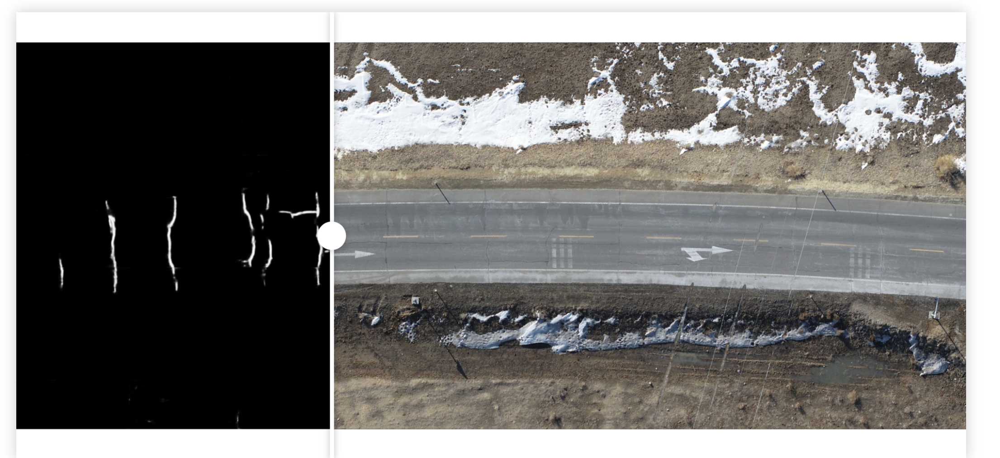
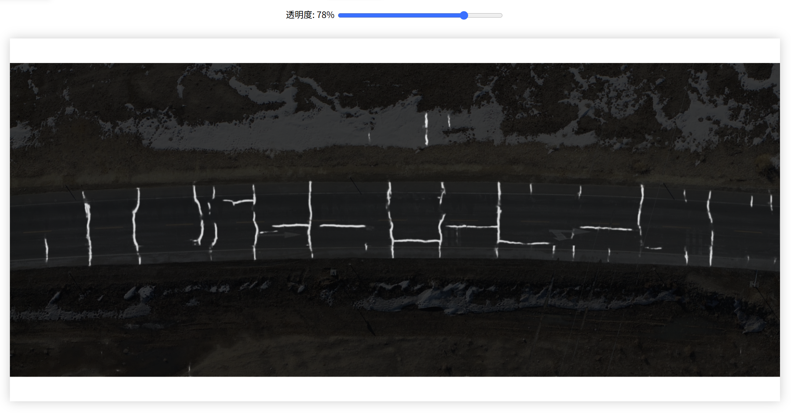
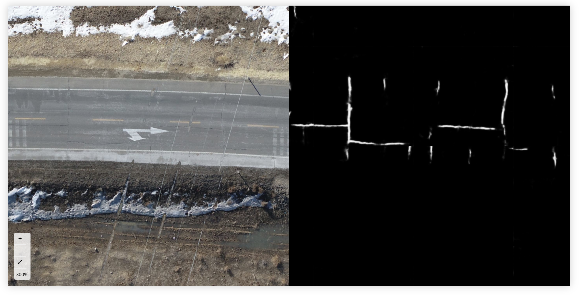

### 项目结构
#### [index.html](index.html)、[script.js](script.js)、[styles.css](styles.css)：源码:可直接运行。
#### dist：此目录下有打包好的exe离线安装包，可单独下载使用。
#### [node_modules](node_modules) ：因为electron的依赖安装异常繁琐，我直接配置好上传了，如果您没有打包要求，忽略此文件的下载。

科研与设计利器！体验「高级图片同步对比器」的多模态图像分析​​

免费工具，支持滑动/淡入淡出/分屏对比，精准捕捉图像差异

---

### 一、工具亮点

1. ​​多模式对比​​

    1. ​​滑动对比​​：通过拖拽滑块实时查看前后图像差异（类似[JuxtaposeJS]的交互设计）。
     

2. ​​淡入淡出​​：调节透明度叠加对比，适合医学影像或艺术品修复中的渐变分析。
       

3. ​​左右分屏​​：并排显示原图与掩码图，支持同步缩放和移动（参考[MedPeer工具]的灵活性）。
   

4. ​​专业级功能​​

    1. 内置​​交换图片​​按钮，快速切换对比视角。

    2. 支持​​局部放大​​和透明度调节，媲美[Beyond Compare]的细节处理能力。

5. ​​轻量化设计​​

    1. 纯前端实现，无需安装，打开浏览器即可使用（类似[imgsli]的便捷性）。
    2. 同时提供纯离线的exe安装版本。

---

### 二、应用场景

* ​​科研领域​​：追踪实验图像变化（如细胞生长、材料结构），精准标注差异区域**5**。

* ​​设计校对​​：对比设计稿修改前后版本，快速定位调整细节。

* ​​教育演示​​：通过分屏展示地理变迁、历史照片修复效果。

---

### 三、同类工具对比

|工具名称|优势|局限性|
|:----|:----|:----|
|高级图片同步对比器|免费、多模式、支持本地文件|暂无批量对比功能|
|Beyond Compare|专业级文件夹/文本/图片对比|收费、操作复杂|
|JuxtaposeJS|开源、嵌入网页|需代码基础，仅支持URL图片|

---

### 四、使用教程

1. ​​上传图片​​：点击左侧“原图”和右侧“掩码图”按钮导入本地文件。

2. ​​选择模式​​：切换顶部按钮（滑动/淡入淡出/分屏）调整对比方式。

3. ​​细节分析​​：使用缩放控件放大关键区域，滑动条调节透明度。

---

​​结语​​：这款工具以简洁界面和强大功能填补了免费图像对比工具的空白，尤其适合科研人员和设计师。立即访问Gitee项目页体验吧！
**免费！免费！免费！**

